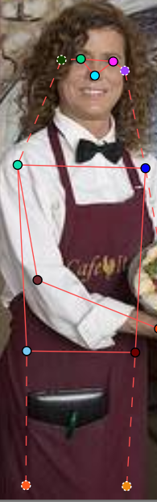
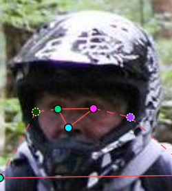
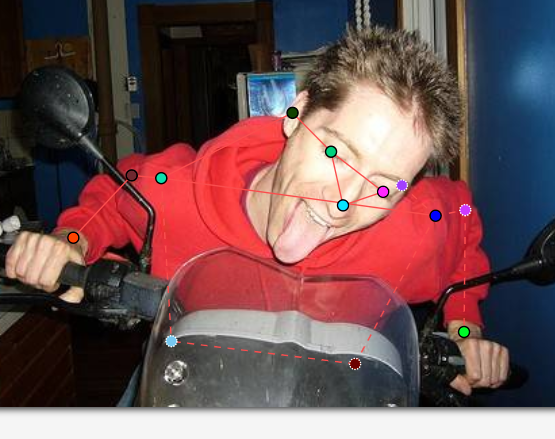
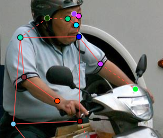
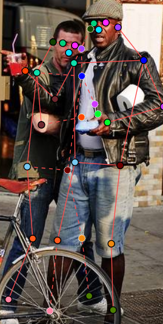
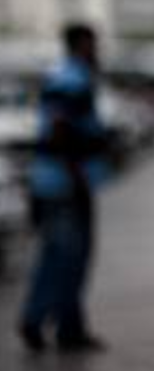

# Mini guideline - nhóm: ______  |  người gán: ______  |  ngày: ______

> Điền file này **trong lúc** gán nhãn, không phải sau khi xong. Mỗi lần bạn dừng lại
> hơn 10 giây để phân vân, đó là một dòng phải ghi vào đây.

## 1. Luật bắt buộc (đã thống nhất cả lớp - không sửa)

- Bộ 17 điểm COCO, đúng tên, đúng thứ tự. Lấy từ file `.SVG` chung.
- Mọi người trong ảnh đều có **đủ 17 điểm**. Điểm không dùng được thì gắn cờ, không xoá.
- Trái/phải tính theo **cơ thể người**, không theo bức ảnh.
- Bị che, còn trong khung -> `v = 1`, **vẫn đặt chấm** ở vị trí ước lượng.
- Ra ngoài mép ảnh -> `v = 0`, **không** đặt chấm.
- Không dùng `Hidden` (`h`) - nó không được lưu vào file.

## 2. Luật của nhóm bạn (phải điền)

| Tình huống                                                   | Luật nhóm bạn chọn                                                                                                           | Vì sao                                                                                                                                           |
| -------------------------------------------------------------- | -------------------------------------------------------------------------------------------------------------------------------- | ------------------------------------------------------------------------------------------------------------------------------------------------- |
| Hông của người mặc quần áo dài                         | Đặt occluded vào bên hông                                           | Mình vẫn có thể ước lượng được vị tri nếu để ý đến đùi và bụng của đối tượng                                           |
| Tai bị tóc hoặc mũ bảo hiểm che một phần               | Đặt occluded cho phần bị che                                         | Mình vẫn ước lượng được vị trí tai dựa vào kích thước đầu mặc dù nó bị che                                                  |
| Người bị cắt ở mép ảnh (chỉ thấy từ hông trở lên) | Phần đùi và mắt cá chân thì được đặt Outside           | Do phần hông bị cắt nên mình để phần chân trở xuống Outside                                                                           |
| Cổ tay nằm sau tay lái / sau thân mình                    | Phần cổ tay bị che thì mình để Occluded                           | Nó không ở bên ngoài ảnh và chỉ bị che nên chỉ để Occluded                                                                           |
| Hai người chồng lên nhau                                   | Đặt Occluded cho bất kì bộ phận bị che đi bởi người còn lại | Các bộ phận bị che thì không phải bên ngoài ảnh và chỉ bị che nên chỉ để Occluded. Còn điểm thì mình ước lượng vị trí |
| Người nhỏ đến mức nào thì không gán nữa             | Người nhỏ và mờ quá                                                | Do quá nhỏ và mờ nên mình không cần phải gán. Dữ liệu mờ và nhỏ thì model cũng khó đọc được để tự gán điểm           |

Với mỗi luật, chèn **một ảnh mẫu** (screenshot từ CVAT) thay vì chỉ viết một câu.
Slide 12 nói rõ: khớp không có bề mặt nhìn thấy được thì phải có ảnh mẫu, không phải
một câu văn chung chung.

## 3. Ba ca mơ hồ đã gặp (bắt buộc, ghi ít nhất 3)

### Ca 1 - ảnh train_13, người thứ 2, cả người

- Mơ hồ ở chỗ nào: người ở đằng sau, bị mờ khó nhìn
- Bạn quyết thế nào:  mình bỏ qua người đó
- Vì sao: do chất lượng ảnh của người khó nhìn
- Nếu người khác quyết ngược lại thì model học sai cái gì: kể cả data khó nhận dạng thì vẫn đặt skeleton cho người đó

### Ca 2 - ảnh train_14, người thứ 2, khớp mặt(tai mũi mắt)

- Mơ hồ ở chỗ nào: cái ô làm mặt trở nên tối, khó nhìn
- Bạn quyết thế nào: ước lượng vị trí khuôn mặt để đặt tiếp, chỉ để occluded cho chỗ bị tre như tai phải
- Vì sao: mình không thể để khuôn mặt trống không trong khi mình vẫn gán được thân dưới
- Nếu người khác quyết ngược lại thì model học sai cái gì: nếu không có mặt model sẽ tưởng có trường hợp người mà không mặt, mặc dù vẫn nhìn thấy đầu

### Ca 3 - ảnh train_6, người thứ 1, khớp từ vai phải trở xuống

- Mơ hồ ở chỗ nào: bên phải người lái xe bị che khuất hoàn toàn nên không biết đặt điểm như thế nào
- Bạn quyết thế nào: mình vẫn ước lượng vị trí các điểm dựa trên tư thế ngồi
- Vì sao: mình không thể đặt điểm sai vị trí và cũng không thể coi nó bị outside
- Nếu người khác quyết ngược lại thì model học sai cái gì: model sẽ nhầm tưởng tư thế lái xe của người đó nếu vị trí khớp bên phải bị đặt không đúng

## 4. Sau khi so visibility report với bạn cùng nhóm

- Khớp lệch `%v=1` nhiều nhất: `______` (bạn `___%` / họ `___%`)
- Nguyên nhân là **guideline chưa rõ** hay **một trong hai bên gán sai**:
- Luật mới bổ sung vào mục 2 sau khi thống nhất:
